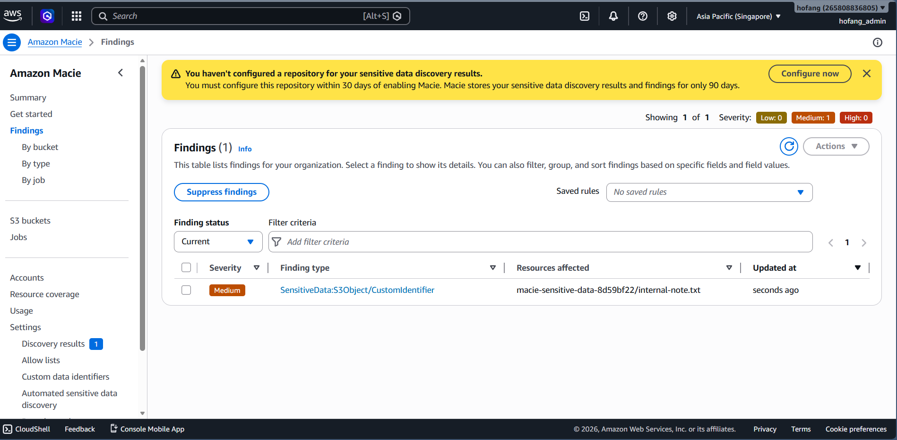
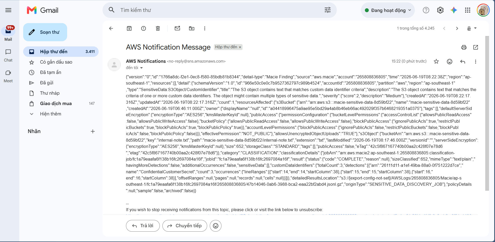

# Phát hiện dữ liệu nhạy cảm trong Amazon S3 bucket và gửi cảnh báo bằng Amazon Macie

## Minh chứng (Evidence)

### 1. Phát hiện của Amazon Macie
*Ảnh chụp màn hình cho thấy Amazon Macie phát hiện dữ liệu nhạy cảm mẫu trong S3 bucket.*

*(Vui lòng đặt ảnh chụp màn hình Macie của bạn vào đây và đặt tên là `macie-detection.png` bên trong thư mục `assets`)*

### 2. Cảnh báo gửi về Email
*Ảnh chụp màn hình thông báo SNS được gửi về hộp thư email với chi tiết của finding.*

*(Vui lòng đặt ảnh chụp màn hình cảnh báo Email của bạn vào đây và đặt tên là `email-alert.png` bên trong thư mục `assets`)*
