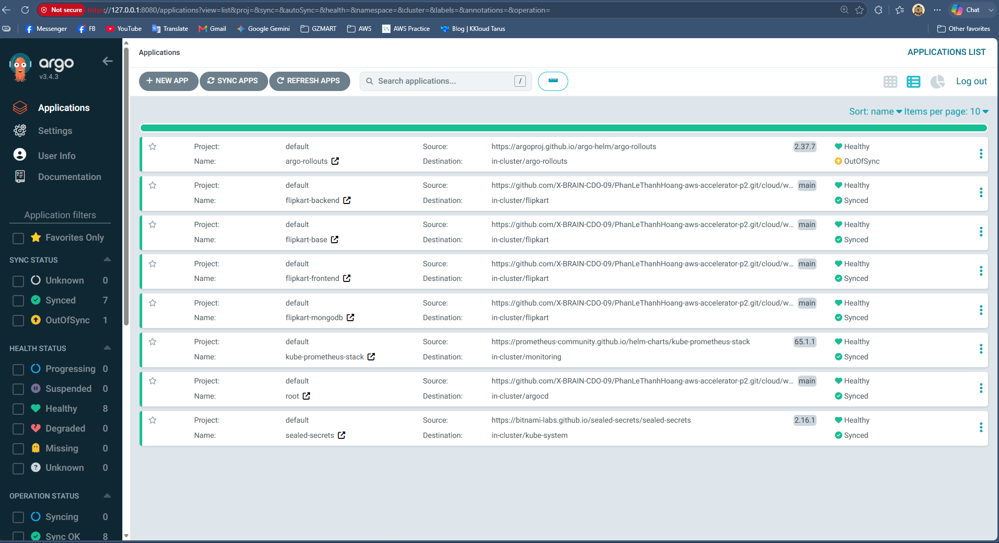
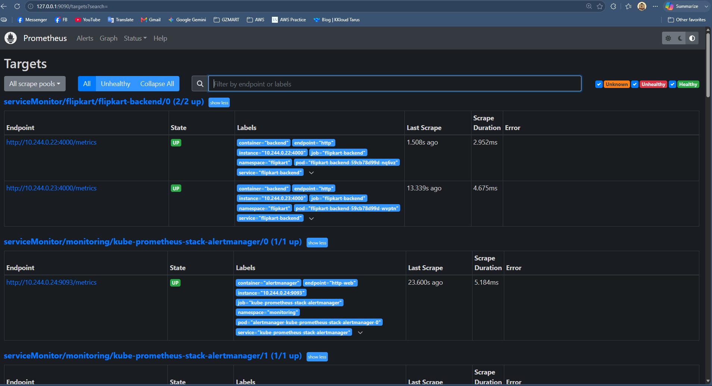
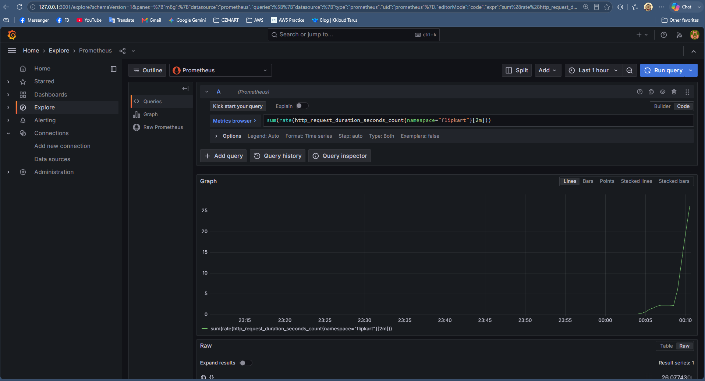
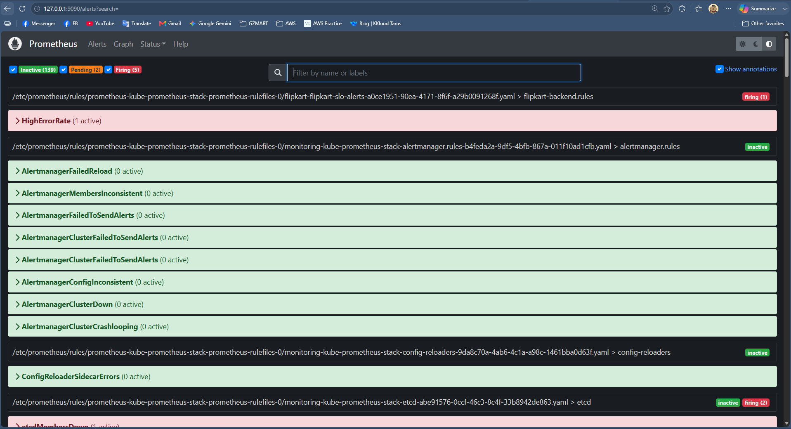
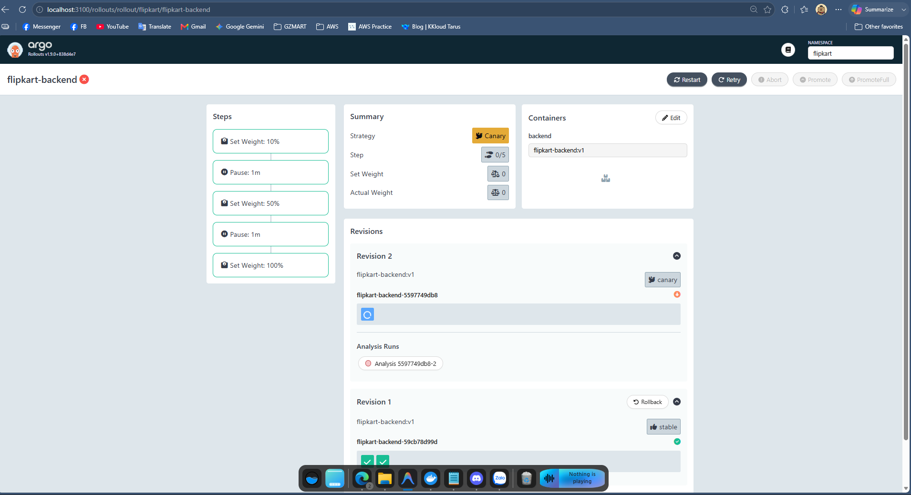
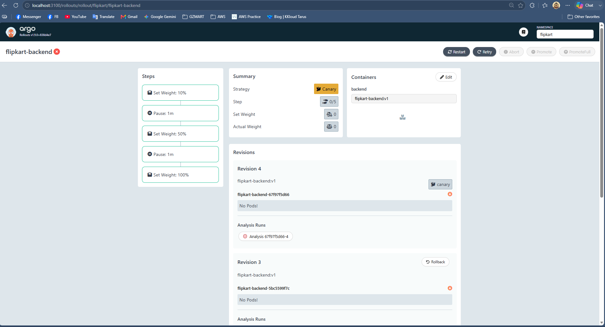
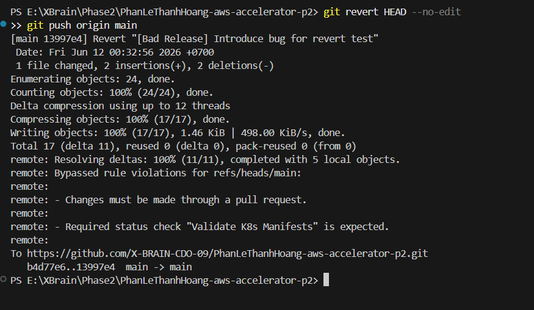

# Báo Cáo Kết Quả Thực Hành (Evidence Pack) - W9: Ship Smartly

Tài liệu này cung cấp các bằng chứng hình ảnh (evidence) chứng minh hệ thống Flipkart đã đáp ứng đầy đủ 4 tiêu chí cốt lõi của bài tập lớn (Challenge: Ship Smartly) dựa trên tài liệu **W9-chieu-obs-canary** và **W9-sang-gitops-final**.

---

## 🟢 Tiêu chí 1: Thay đổi qua Git & ArgoCD Synced (No drift)

Hệ thống tuân thủ chặt chẽ nguyên tắc **OpenGitOps**: Git là "Single Source of Truth". Không có thao tác `kubectl apply` thủ công nào được thực hiện. 
Toàn bộ kiến trúc (từ Infrastructure như Prometheus, Rollouts đến Application như Backend, Frontend) đều được cấu hình qua Git và được ArgoCD theo dõi, đồng bộ tự động.

*Ảnh 1: Giao diện ArgoCD hiển thị toàn bộ hệ thống (App-of-Apps) đều đạt trạng thái `Synced` (đồng bộ hoàn toàn với Git) và `Healthy` (đang chạy ổn định).*

---

## 🟢 Tiêu chí 2: Đo lường SLO & Cảnh báo tự động (Alerting)

Việc đánh giá tình trạng "sức khỏe" của ứng dụng không dựa vào cảm tính mà dựa vào số liệu (Metrics). 
Backend Node.js đã mở cổng `/metrics`, và Prometheus được cấu hình `ServiceMonitor` để liên tục tự động thu thập (scrape) dữ liệu.

*Ảnh 2: Prometheus đã tự động phát hiện (discover) mục tiêu `flipkart-backend` và kết nối thành công (trạng thái `UP`).*

Từ dữ liệu thô, hệ thống có thể tính toán ra các chỉ số cam kết chất lượng dịch vụ (SLI - Service Level Indicator):

*Ảnh 3: Biểu đồ truy vấn (PromQL) trên Grafana/Prometheus tính toán tỷ lệ request thành công theo thời gian thực để đối chiếu với SLO.*

Khi cố tình tạo ra một "Bad Release" (Sửa biến môi trường `ERROR_RATE=0.5` đẩy lên Git), tỷ lệ lỗi của ứng dụng lập tức vượt ngưỡng cho phép. Luật cảnh báo `HighErrorRate` được kích hoạt ngay lập tức để gửi về email cá nhân qua Alertmanager:

*Ảnh 4: Cảnh báo chất lượng dịch vụ (SLO Alert) chuyển trạng thái thành mức độ cao nhất (FIRING đỏ rực) do phát hiện lỗi nghiêm trọng.*

---

## 🟢 Tiêu chí 3: Progressive Delivery - Bản lỗi tự động Abort (Quan trọng nhất)

Để tránh tình trạng "Deploy một phát dính lỗi toàn bộ 100% user", hệ thống sử dụng **Argo Rollouts** với chiến lược Canary. Traffic sẽ được điều phối tăng dần lên phiên bản mới.

*Ảnh 6: Quá trình Canary tạm dừng (Paused) nâng traffic ở các bước trung gian (10% hoặc 50%). Tại thời điểm này, `AnalysisTemplate` đang phân tích Metrics từ Prometheus để ra quyết định.*

Vì đây là phiên bản lỗi (Bad Release), chỉ báo thành công (Success Rate) từ Prometheus trả về cực kỳ tệ, không đạt ngưỡng SLO >= 95%. Hệ thống tự động kích hoạt tính năng **Auto-Abort** để tự bảo vệ cụm:

*Ảnh 8: Phân tích (AnalysisRun) đánh trượt phiên bản mới. Nhánh Canary lập tức chuyển sang trạng thái `Degraded` (bị gạch chéo đỏ), đồng thời cắt ngay lập tức toàn bộ 100% traffic đổ ngược lại về phiên bản cũ (Stable) an toàn. Quá trình này không cần bất kỳ sự can thiệp thủ công nào.*

---

## 🟢 Tiêu chí 4: Rollback qua Git trong vòng dưới 5 phút

Mặc dù hệ thống đã tự bảo vệ thành công (Abort trên cụm K8s), nhưng mã nguồn trên Git vẫn đang mang cấu hình bị lỗi. Trong mô hình GitOps, mọi lệnh rollback thủ công (`kubectl rollout undo`) sẽ bị cơ chế Self-heal ghi đè.
Cách duy nhất và chuẩn xác nhất là đảo ngược thay đổi (Revert) trên nguồn sự thật (Git).

*Ảnh 9: Thao tác `git revert HEAD` để khôi phục lại code tốt, sau đó `git push`. Ngay khi có thay đổi trên nhánh main, ArgoCD tự động kéo cấu hình về và Reconcile lại cụm. Tổng thời gian xử lý sự cố hoàn thành xuất sắc dưới mức 5 phút.*

---
**Kết luận:** Hệ thống đã hoàn thiện chuỗi luồng an toàn: *Triển khai qua Git -> Thả Canary dần dần -> Metric tự đánh giá -> Tệ thì Auto-Abort -> Khôi phục qua Git*. Hoàn thành mục tiêu của thử thách "Ship Smartly".
