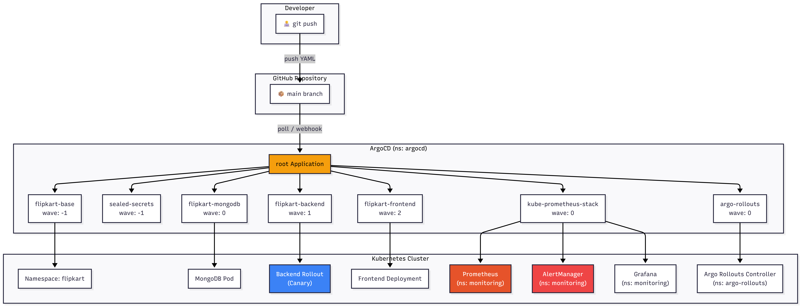
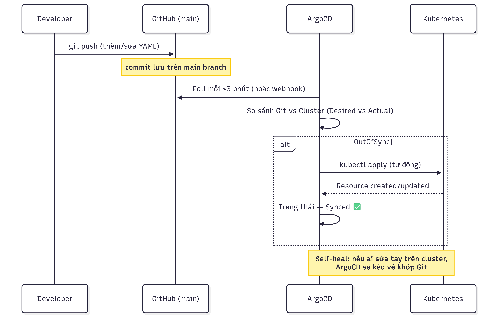
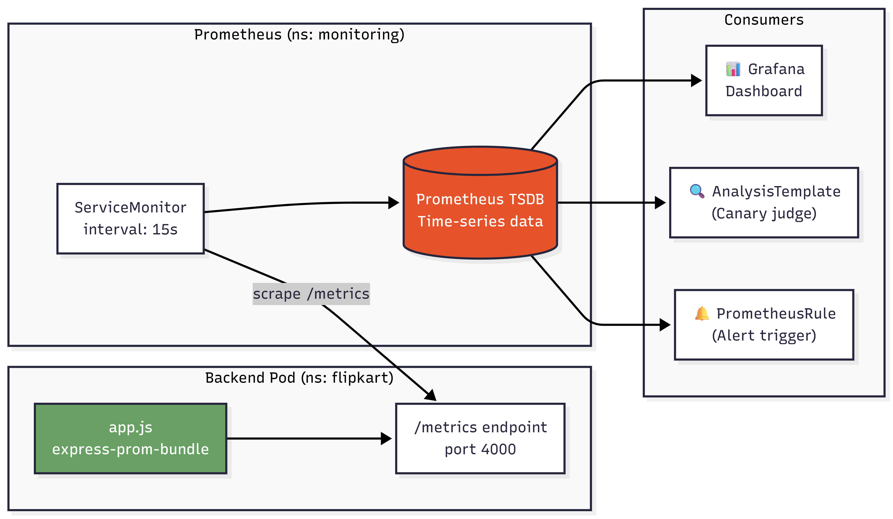
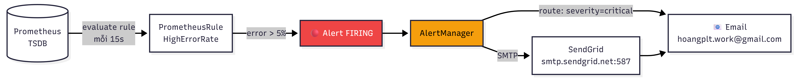
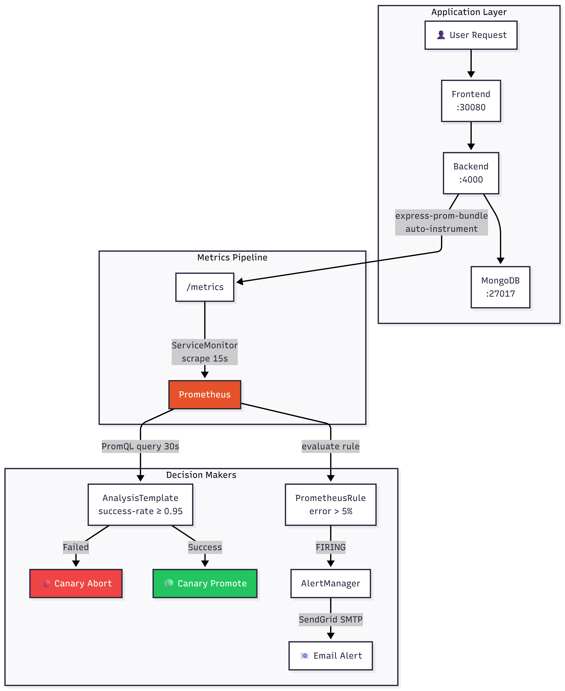

# GitOps & Observability Architecture — Flipkart Project

Tài liệu mô tả chi tiết luồng hoạt động, kiến trúc hệ thống, và các file/dòng code quan trọng.

---

## Kiến trúc tổng quan (High-Level Architecture)



---

## 1. Luồng khởi tạo Kubernetes (App-of-Apps GitOps)

### Cơ chế hoạt động



### Thứ tự khởi tạo (Sync Waves)

Hệ thống sử dụng annotation `argocd.argoproj.io/sync-wave` để kiểm soát thứ tự. Wave nhỏ chạy trước, ArgoCD đợi wave trước `Healthy` rồi mới sang wave sau.

| Wave | Loại | ArgoCD App file | Resource được tạo | Namespace |
|------|------|----------------|-------------------|-----------|
| **-1** | Infra | `base.yaml` | Namespace `flipkart` + Secret `flipkart-secrets` | `flipkart` |
| **0** | Infra | `kube-prometheus-stack.yaml` | Prometheus + Grafana + AlertManager (Helm chart v65.1.1) | `monitoring` |
| **0** | Infra | `argo-rollouts.yaml` | Argo Rollouts Controller (Helm chart v2.37.7) | `argo-rollouts` |
| **0** | App | `mongodb.yaml` | MongoDB Deployment + Service `mongo-svc` | `flipkart` |
| **1** | App | `backend.yaml` | Rollout + Service + ServiceMonitor + PrometheusRule + AnalysisTemplate | `flipkart` |
| **2** | App | `frontend.yaml` | Frontend Deployment + Service (NodePort 30080) | `flipkart` |

Bên trong mỗi ArgoCD Application, các resource con cũng có sync-wave riêng. Ví dụ trong thư mục `k8s/backend/`:

| Wave nội bộ | File | Resource |
|-------------|------|----------|
| **1** | `servicemonitor.yaml` | ServiceMonitor (Prometheus scrape) |
| **1** | `prometheusrule.yaml` | PrometheusRule (Alert HighErrorRate) |
| **1** | `analysistemplate.yaml` | AnalysisTemplate (Canary success-rate) |
| **2** | `rollout.yaml` | Rollout (Backend pods) |
| **2** | `service.yaml` | Service flipkart-backend:4000 |

### Điểm bắt đầu — `argocd/root.yaml`

```yaml
# argocd/root.yaml — Apply THỦ CÔNG 1 lần duy nhất
kind: Application
metadata:
  name: root
  namespace: argocd          # ← "Bản vẽ" nằm ở văn phòng ArgoCD
spec:
  source:
    repoURL: https://github.com/X-BRAIN-CDO-09/PhanLeThanhHoang-aws-accelerator-p2.git
    targetRevision: main
    path: cloud/w9/flipkart/argocd/apps   # ← trỏ tới thư mục chứa 7 Application con
  destination:
    server: https://kubernetes.default.svc
    namespace: argocd         # ← Destination cũng là argocd vì con cũng là kind: Application
  syncPolicy:
    automated:
      prune: true             # ← Xóa file khỏi Git → xóa App khỏi cluster
      selfHeal: true          # ← Ai sửa tay → tự kéo về khớp Git
```

> **Lưu ý:** `metadata.namespace: argocd` = nơi lưu "bản vẽ" Application. `spec.destination.namespace` = nơi tạo resource thực tế. Hai namespace này khác nhau ở các App con (vd backend destination là `flipkart`).

---

## 2. Luồng Monitoring (Metrics Pipeline)



### Bước 1: Backend phơi bày Metrics — `backend/app.js` (dòng 15-25)

```javascript
// backend/app.js — DÒNG QUAN TRỌNG NHẤT cho Observability
const promBundle = require("express-prom-bundle");     // dòng 15
const metricsMiddleware = promBundle({
    includeMethod: true,      // ghi nhận GET/POST/PUT/DELETE
    includePath: true,        // ghi nhận đường dẫn (/api/v1/products, ...)
    includeStatusCode: true,  // ghi nhận 200, 404, 500, ...
    includeUp: true,          // metric "up" cho health check
    promClient: {
        collectDefaultMetrics: {}  // CPU, memory, event loop, ...
    }
});
app.use(metricsMiddleware);    // dòng 25 — GẮN middleware TRƯỚC mọi route
```

**Kết quả:** Tự động tạo metric `http_request_duration_seconds_count` (counter) và `http_request_duration_seconds_bucket` (histogram) cho MỌI HTTP request đi qua Express. Endpoint `/metrics` tự động được tạo.

### Bước 2: Error Injection cho Canary Testing — `backend/app.js` (dòng 28-34)

```javascript
// backend/app.js — Cơ chế tạo lỗi giả để test Canary
const ERROR_RATE = parseFloat(process.env.ERROR_RATE || "0");  // dòng 28
app.use((req, res, next) => {
    if (Math.random() < ERROR_RATE) {                          // dòng 30
        return res.status(500).json({                          // trả 500 → Prometheus đếm
            error: "Injected error for testing",
            version: process.env.VERSION || "v1"
        });
    }
    next();
});
```

**Ý nghĩa:** Biến `ERROR_RATE` được set từ `k8s/backend/rollout.yaml` (env). Đặt `0.5` = 50% request trả 500 → metric `status_code="500"` tăng vọt → AnalysisTemplate phát hiện → Auto-abort.

### Bước 3: Prometheus tự động scrape — `k8s/backend/servicemonitor.yaml`

```yaml
# ServiceMonitor — "bản hướng dẫn" cho Prometheus biết scrape ở đâu
kind: ServiceMonitor
metadata:
  labels:
    release: kube-prometheus-stack   # ⚠️ BẮT BUỘC — Prometheus chỉ nhận SM có label này
spec:
  selector:
    matchLabels:
      app: flipkart-backend          # tìm Service có label app=flipkart-backend
  endpoints:
    - port: http                     # scrape port tên "http" (= 4000 trong service.yaml)
      path: /metrics                 # endpoint chứa metrics
      interval: 15s                  # tần suất lấy dữ liệu: mỗi 15 giây
```

### Cấu hình Prometheus quan trọng — `argocd/apps/kube-prometheus-stack.yaml` (dòng 17-18)

```yaml
prometheus:
  prometheusSpec:
    serviceMonitorSelectorNilUsesHelmValues: false
    # ↑ QUAN TRỌNG: false = Prometheus tìm MỌI ServiceMonitor trong cluster
    #   Nếu để true (default), nó chỉ tìm SM có label helm release → bỏ sót SM của bạn
```

---

## 3. Luồng Alerting (Cảnh báo)



### PrometheusRule — `k8s/backend/prometheusrule.yaml`

```yaml
kind: PrometheusRule
metadata:
  labels:
    release: kube-prometheus-stack    # ⚠️ BẮT BUỘC — giống ServiceMonitor
spec:
  groups:
  - name: flipkart-backend.rules
    rules:
    - alert: HighErrorRate
      expr: |
        sum(rate(http_request_duration_seconds_count{namespace="flipkart", status_code=~"5.."}[1m]))
        / sum(rate(http_request_duration_seconds_count{namespace="flipkart"}[1m])) > 0.05
      # ↑ PromQL: tỷ lệ request 5xx / tổng request trong 1 phút > 5% → FIRE
      for: 0m                        # fire ngay lập tức, không đợi
      labels:
        severity: critical            # gắn nhãn để AlertManager route đúng receiver
```

### AlertManager Config — `argocd/apps/kube-prometheus-stack.yaml` (dòng 19-43)

```yaml
alertmanager:
  alertmanagerSpec:
    secrets:
      - alertmanager-smtp-credentials   # K8s Secret chứa SendGrid API Key
                                        # được mount vào /etc/alertmanager/secrets/...
  config:
    global:
      smtp_smarthost: 'smtp.sendgrid.net:587'
      smtp_from: 'ringhost42@gmail.com'
      smtp_auth_username: 'apikey'                    # SendGrid bắt buộc username = "apikey"
      smtp_auth_password_file: '/etc/alertmanager/secrets/alertmanager-smtp-credentials/password'
    route:
      group_by: ['alertname']          # gom alert cùng tên vào 1 notification
      group_wait: 30s                  # đợi 30s gom thêm alert cùng nhóm
      receiver: 'email-alerts'         # receiver mặc định
      routes:
        - match:
            severity: critical         # alert severity=critical → route vào email-alerts
          receiver: 'email-alerts'
    receivers:
      - name: 'email-alerts'
        email_configs:
          - to: 'hoangplt.work@gmail.com'
            send_resolved: true        # gửi email khi alert tắt (resolved) luôn
```

---

## 4. Luồng Progressive Delivery (Canary Auto-Abort)


### Rollout (thay thế Deployment) — `k8s/backend/rollout.yaml`

```yaml
kind: Rollout                          # ← KHÔNG phải Deployment. CRD của Argo Rollouts
metadata:
  name: flipkart-backend
spec:
  replicas: 2
  template:
    spec:
      containers:
        - name: backend
          image: flipkart-backend:v1
          imagePullPolicy: Never       # ← dùng image local (minikube image load)
          ports:
            - name: http               # ← tên port này phải khớp với ServiceMonitor
              containerPort: 4000
          env:
            - name: ERROR_RATE
              value: "0"               # ⚠️ ĐỔI thành "0.5" để test Bad Release
            - name: VERSION
              value: "v1"              # ⚠️ ĐỔI thành "v2-bad" để trigger canary
  strategy:
    canary:
      analysis:
        templates:
        - templateName: success-rate   # ← trỏ tới AnalysisTemplate cùng namespace
        startingStep: 1               # ← bắt đầu phân tích từ step thứ 1 (sau setWeight 10%)
      steps:
      - setWeight: 10                  # Bước 0: 10% traffic cho bản mới
      - pause: {duration: 1m}          # Bước 1: đợi 1 phút (Analysis bắt đầu chạy ở đây)
      - setWeight: 50                  # Bước 2: nâng lên 50%
      - pause: {duration: 1m}          # Bước 3: đợi thêm 1 phút
      - setWeight: 100                 # Bước 4: full traffic
```

### AnalysisTemplate — `k8s/backend/analysistemplate.yaml`

```yaml
kind: AnalysisTemplate
metadata:
  name: success-rate
spec:
  metrics:
  - name: success-rate
    interval: 30s                      # query Prometheus mỗi 30 giây
    successCondition: result >= 0.95   # ≥ 95% request thành công → PASS
    failureLimit: 3                    # thất bại 3 lần liên tiếp → ABORT
    provider:
      prometheus:
        address: http://kube-prometheus-stack-prometheus.monitoring.svc:9090
        # ↑ Service DNS nội bộ của Prometheus trong namespace monitoring
        query: |
          sum(rate(http_request_duration_seconds_count{namespace="flipkart", status_code!~"5.."}[2m]))
          / sum(rate(http_request_duration_seconds_count{namespace="flipkart"}[2m]))
          # ↑ PromQL: (request không phải 5xx trong 2 phút) / (tổng request trong 2 phút)
          #   Kết quả: 1.0 = 100% thành công, 0.5 = 50% lỗi
```

**So sánh 2 kịch bản:**

| | 🟢 Good Release (ERROR_RATE=0) | 🔴 Bad Release (ERROR_RATE=0.5) |
|---|---|---|
| Success rate | 1.0 (≥ 0.95 ✅) | ~0.5 (< 0.95 ❌) |
| AnalysisRun | Successful | Failed (3 lần liên tiếp) |
| Kết quả | Canary tự promote lên 100% | **Auto-abort**, traffic về v1 |
| Thời gian | ~4 phút (2 pause × 1m + analysis) | ~2-3 phút (abort sớm) |

---

## 5. Luồng dữ liệu End-to-End (Data Flow)



---

## 6. Cấu trúc thư mục & File quan trọng

```
flipkart/
├── argocd/
│   ├── root.yaml                    ← Điểm khởi đầu, apply THỦ CÔNG 1 lần duy nhất
│   └── apps/                        ← 7 Application con (root tự quản)
│       ├── base.yaml                   wave -1: Namespace + Secrets
│       ├── sealed-secrets.yaml         wave -1: Bitnami Sealed Secrets
│       ├── kube-prometheus-stack.yaml  wave  0: Prometheus + Grafana + AlertManager
│       ├── argo-rollouts.yaml          wave  0: Argo Rollouts Controller
│       ├── mongodb.yaml                wave  0: Database
│       ├── backend.yaml                wave  1: API (Canary Rollout)
│       └── frontend.yaml              wave  2: React UI
│
├── k8s/
│   ├── base/
│   │   ├── namespace.yaml           ← Tạo ns flipkart (wave -1, chạy ĐẦU TIÊN)
│   │   └── secrets.yaml             ← MONGO_URI, JWT_SECRET, ... (wave 0)
│   ├── mongodb/
│   │   ├── deployment.yaml          ← mongo:7, emptyDir volume (wave 1)
│   │   └── service.yaml             ← ClusterIP mongo-svc:27017 (wave 1)
│   ├── backend/
│   │   ├── deployment.yaml          ← [DEPRECATED] — đã thay bằng rollout.yaml
│   │   ├── rollout.yaml             ← ⭐ Canary strategy, ERROR_RATE env (wave 2)
│   │   ├── service.yaml             ← ClusterIP flipkart-backend:4000 (wave 2)
│   │   ├── servicemonitor.yaml      ← ⭐ Prometheus scrape config (wave 1)
│   │   ├── prometheusrule.yaml      ← ⭐ HighErrorRate alert rule (wave 1)
│   │   └── analysistemplate.yaml    ← ⭐ Canary judge: query success-rate (wave 1)
│   └── frontend/
│       ├── deployment.yaml          ← flipkart-frontend:v1, 2 replicas (wave 3)
│       └── service.yaml             ← NodePort 30080 (wave 3)
│
├── backend/
│   └── app.js                       ← ⭐ express-prom-bundle + Error Injection middleware
│
└── Dockerfile.backend               ← node:18-alpine, EXPOSE 4000
```

---

## 7. Những cấu hình/setting cần chú ý

### ⚠️ Label bắt buộc
- `ServiceMonitor` và `PrometheusRule` **phải có** label `release: kube-prometheus-stack`. Thiếu label này → Prometheus bỏ qua → không có metrics/alert.

### ⚠️ ServiceMonitor selector
- Helm values `serviceMonitorSelectorNilUsesHelmValues: false` trong `kube-prometheus-stack.yaml` dòng 18. Nếu thiếu dòng này, Prometheus chỉ nhận ServiceMonitor có label mặc định của Helm → bỏ sót ServiceMonitor custom.

### ⚠️ Port naming
- `rollout.yaml` khai báo port name `http` (dòng 25). `servicemonitor.yaml` scrape port name `http` (dòng 16). `service.yaml` cũng dùng port name `http` (dòng 15). **Ba chỗ phải khớp tên.**

### ⚠️ Secret cho AlertManager SMTP
- Secret `alertmanager-smtp-credentials` phải tồn tại trong namespace `monitoring` với key `password` chứa SendGrid API Key. Thiếu → AlertManager `CrashLoopBackOff`.

### ⚠️ ERROR_RATE khi chạy production
- Đảm bảo `ERROR_RATE` trong `rollout.yaml` dòng 32 luôn là `"0"` khi không đang test. Quên đổi lại sau khi test → hệ thống liên tục abort.

### ⚠️ AnalysisTemplate address
- `analysistemplate.yaml` dòng 16 dùng DNS nội bộ `http://kube-prometheus-stack-prometheus.monitoring.svc:9090`. Tên service này phụ thuộc vào tên Helm release. Nếu đổi tên release → phải cập nhật address.
