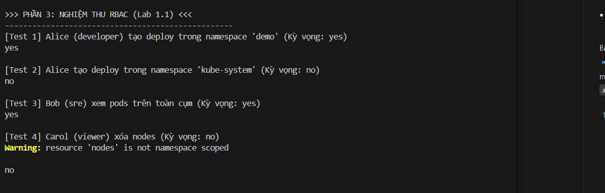
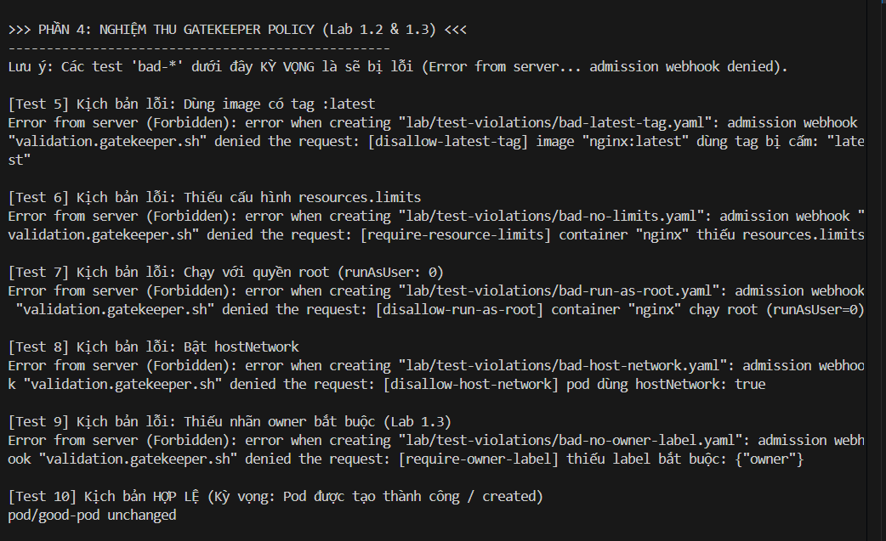
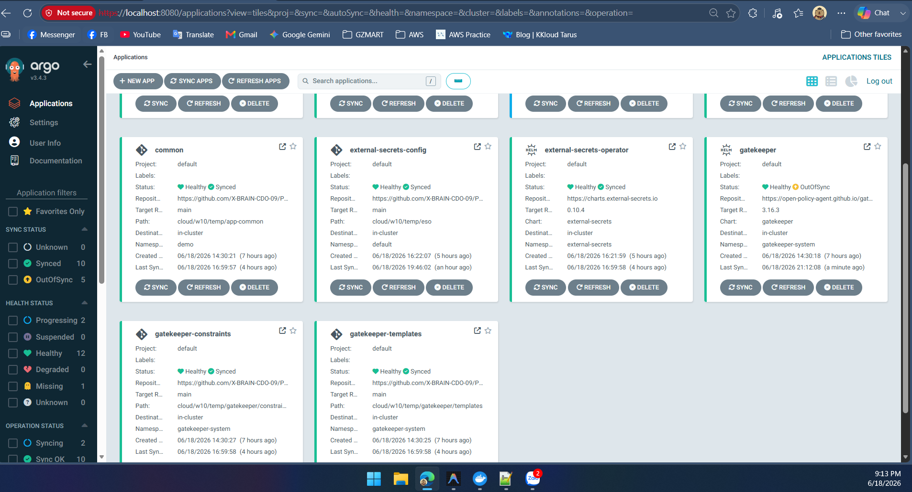
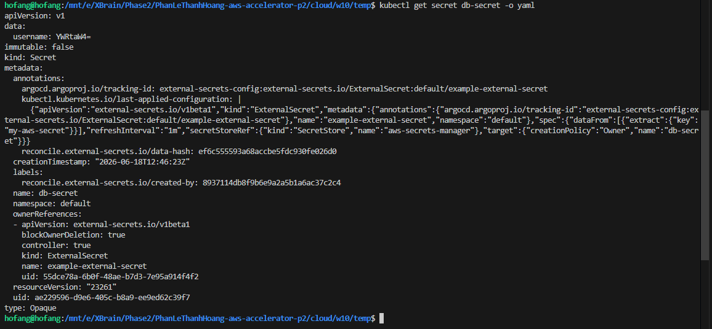
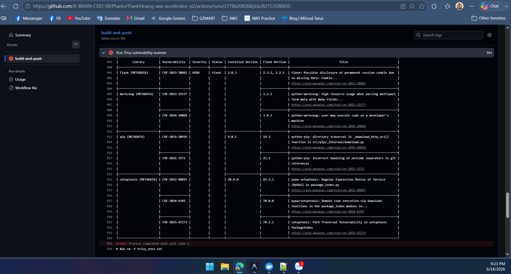
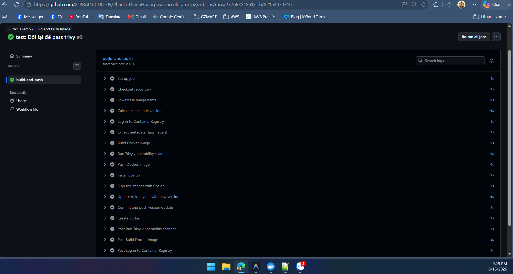
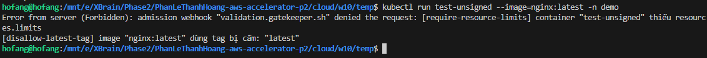
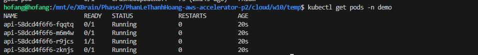

# Bằng Chứng Thực Hành W10 (Lab 1 & Lab 2)

Tài liệu này lưu trữ các bằng chứng (hình ảnh) chứng minh hệ thống đã được cấu hình và hoạt động đúng theo yêu cầu của Lab buổi sáng (Lab 1) và buổi chiều (Lab 2).

## PHẦN 1: LAB 1 (Buổi Sáng) - RBAC & OPA Gatekeeper

### 1.1. Phân quyền RBAC (Alice, Bob, Carol)
*Mô tả: Cửa sổ Terminal chụp kết quả các lệnh `kubectl auth can-i` chứng minh Alice chỉ tạo được app trong `demo`, Bob xem được toàn cụm, Carol bị cấm xoá Node.*

### 1.2. Gatekeeper chặn các Manifest vi phạm
*Mô tả: Hình chụp Terminal hiển thị kết quả bị từ chối (denied) bởi admission webhook khi apply các file cấu hình xấu (`bad-latest-tag.yaml`, `bad-no-limits.yaml`, `bad-run-as-root.yaml`, `bad-host-network.yaml`).*

### 1.3. Custom Constraint bắt buộc Label `owner`
*Mô tả: Cửa sổ Terminal hiển thị lỗi "Thiếu label bắt buộc: owner" khi apply `bad-no-owner-label.yaml`, và báo `created` thành công đối với `good-pod.yaml`.*

---

## PHẦN 2: LAB 2 (Buổi Chiều) - ESO & Supply Chain

### 2.1. Lab 2.1: External Secrets Operator (ESO)
#### A. Đồng bộ Secret từ AWS thành công
*Mô tả: Giao diện ArgoCD hiển thị App `external-secrets-config` trạng thái Healthy/Synced, hoặc kết quả lệnh `kubectl get externalsecret` báo Ready.*

#### B. Dữ liệu Secret trong Kubernetes
*Mô tả: Lệnh `kubectl get secret db-secret -o yaml` hiển thị dữ liệu mật khẩu lấy về từ AWS.*

### 2.2. Lab 2.2: Supply Chain Security (Trivy + Cosign)
#### A. Trivy chặn đứng Image chứa lỗ hổng (CVE HIGH/CRITICAL)
*Mô tả: Giao diện GitHub Actions báo đỏ ở bước "Run Trivy vulnerability scanner" do phát hiện lỗ hổng.*

#### B. Cosign ký thành công Image an toàn
*Mô tả: Giao diện GitHub Actions báo xanh lá toàn bộ, đặc biệt ở bước "Sign the images with Cosign".*

#### C. Admission Controller chặn Image chưa ký
*Mô tả: Lệnh `kubectl run` bằng image `nginx:latest` bị hệ thống báo lỗi từ chối vì không có chữ ký của Cosign.*

#### D. Khởi tạo thành công Pod từ Image đã ký
*Mô tả: App `w10-api` (Image đã được ký ở bước CI) được khởi tạo thành công và đang chạy trong Kubernetes (Running).*

