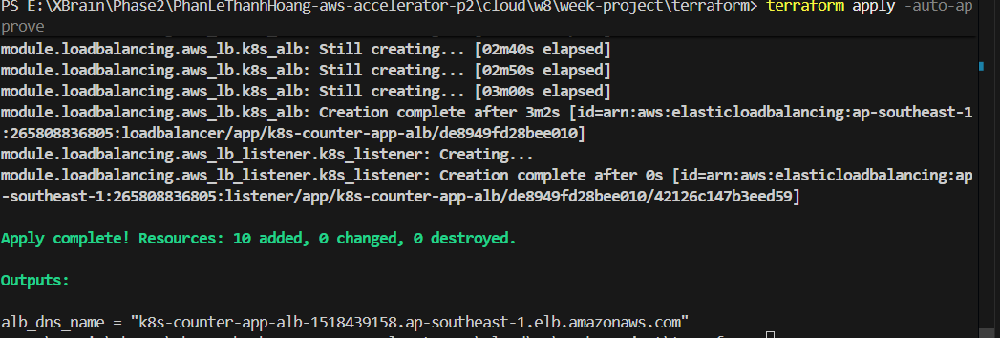
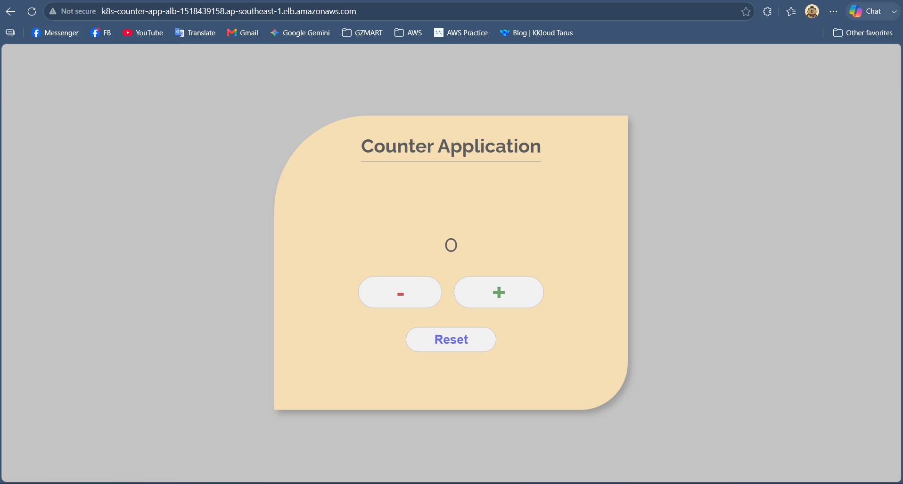
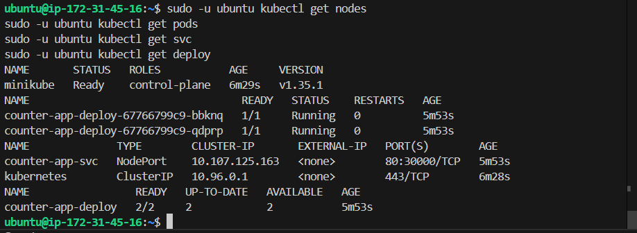

# Evidence - K8s on AWS Terraform 1-Click

## Nộp Gì

Deliverables:
- Repo Terraform đầy đủ trong folder `week-project`.
- `README.md` đầy đủ hướng dẫn.
- Bằng chứng app chạy qua ALB (ảnh/clip).
- Bằng chứng destroy sạch.

## Lệnh Chạy

Chạy từ folder `terraform`:

```bash
terraform init
terraform apply -auto-approve
```

Lấy URL ALB:

```bash
terraform output alb_dns_name
```

Destroy:

```bash
terraform destroy -auto-approve
```

## Bằng Chứng Cần Chụp

### 1. Terraform Apply Thành Công

Chụp terminal có output `Apply complete` và các outputs.

Ảnh/clip:


### 2. URL ALB Mở Được App

URL: `http://k8s-counter-app-alb-1518439158.ap-southeast-1.elb.amazonaws.com`

Bằng chứng browser:

### 3. App Thực Sự Chạy Trong Kubernetes

SSH vào EC2 để kiểm tra:

```bash
ssh -i k8s-key.pem ubuntu@47.129.242.88
```

Kiểm tra cluster:

```bash
sudo -u ubuntu kubectl get nodes
sudo -u ubuntu kubectl get pods
sudo -u ubuntu kubectl get svc
sudo -u ubuntu kubectl get deploy
```

Bằng chứng (Chụp output các lệnh trên trong EC2):

### 4. ALB Forward Vào NodePort

Port matching:
```text
ALB :80 -> EC2 :30000 -> socat port forward -> Minikube IP :30000 -> Service NodePort :30000 -> Pod :80
```

Các nơi dùng chung biến `app_port = 30000`:
- ALB Target Group port.
- EC2 Security Group ingress.
- `socat` listen và forward port.
- Kubernetes Service `nodePort`.

Bằng chứng (Output AWS CLI báo Target Group Healthy):
```json
{
    "TargetHealthDescriptions": [
        {
            "Target": {
                "Id": "i-07a2dbd5eaad21d97",
                "Port": 30000
            },
            "HealthCheckPort": "30000",
            "TargetHealth": {
                "State": "healthy"
            }
        }
    ]
}
```

### 5. Destroy Sạch

Chạy:

```bash
terraform destroy -auto-approve
```

Bằng chứng terminal báo `Destroy complete!`:

## Provider Wire

Providers được dùng trong cùng cấu hình Terraform:
- `hashicorp/aws`
- `hashicorp/tls`
- `hashicorp/local`

Wire:
```text
tls_private_key.k8s_key
-> aws_key_pair.k8s_key_pair
-> aws_instance.k8s_node (key_name)
```
```text
tls_private_key.k8s_key
-> local_file.private_key
-> k8s-key.pem (lưu xuống máy tính để tiện việc SSH debug)
```
```text
templatefile("init.sh", {app_port = 30000})
-> aws_instance.k8s_node (user_data)
```

## Acceptance Checklist

- [x] `1` lệnh từ repo sạch dựng được toàn bộ (`terraform apply -auto-approve`).
- [x] `terraform output alb_dns_name` trả về URL ALB.
- [x] Browser mở URL ALB thấy trang web app.
- [x] App chạy trong Kubernetes Pod (Minikube), không chạy trực tiếp trên EC2.
- [x] Service là `NodePort` và dùng port cố định `30000`.
- [x] ALB target group forward vào EC2 port `30000`.
- [x] Có ít nhất `2` providers được wire trong cùng cấu hình (`aws`, `tls`, `local`).
- [x] Giải thích được vì sao chọn `Minikube + socat + NodePort + ALB`.
- [x] `terraform destroy -auto-approve` dọn sạch sau khi test.
- [x] Có thể dựng lại từ đầu cho kết quả tương đương.

## Vì Sao Thiết Kế Này Đạt

- **`Minikube`** chạy Kubernetes single-node trên EC2, đáp ứng đủ yêu cầu dùng Kubernetes trên 1 EC2.
- App được deploy tự động bằng `kubectl apply` trong `user_data` script, chạy trong **Kubernetes Pod** chứ không chạy bare-metal.
- Việc sử dụng public image trên Docker Hub giúp loại bỏ sự phức tạp của ECR trong bài lab, tập trung hoàn toàn vào K8s deployment và ALB Load Balancing.
- Do Minikube tạo một mạng ảo riêng bên trong EC2 (Docker driver), việc dùng lệnh **`socat`** để forward port giúp mở thông đường từ máy chủ vật lý EC2 vào mạng của Minikube một cách gọn gàng, hiệu quả.
- **ALB** public expose app ra Internet qua HTTP port `80`, đảm bảo kiến trúc mạng theo chuẩn (Load Balancer đứng trước che chở cho EC2).
- Các provider phụ trợ **`tls`**, **`local`** có vai trò thiết thực để sinh SSH Key tự động, giải quyết bài toán truy cập EC2 debug mà không cần tạo key thủ công trên Console.
- Thiết kế đơn giản, tập trung, destroy dọn sạch 100% resource.
