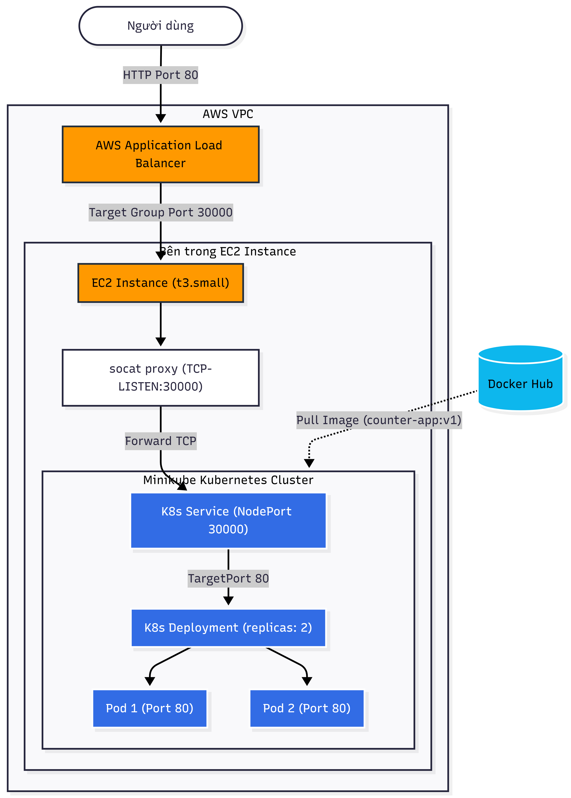

# Tuần 8 Challenge: K8s on AWS (Terraform 1-Click)

## 1. Hướng dẫn chạy (How to run)
1. Đảm bảo bạn đã cài đặt `terraform` và `aws cli`, đồng thời đã cấu hình AWS Credentials (`aws configure`).
2. Di chuyển vào thư mục chứa code hạ tầng:
   ```bash
   cd terraform
   ```
3. Khởi tạo Terraform:
   ```bash
   terraform init
   ```
4. Chạy lệnh tạo toàn bộ hạ tầng (1-click):
   ```bash
   terraform apply -auto-approve
   ```
5. Đợi khoảng 3-5 phút để EC2 cài đặt Minikube và deploy ứng dụng. Truy cập vào đường link ALB được in ra ở Terminal để xem kết quả.

## 2. Lệnh dọn dẹp (How to destroy)
Để tránh phát sinh chi phí, sau khi test xong hãy chạy:
```bash
cd terraform
terraform destroy -auto-approve
```

## 3. Sơ đồ kiến trúc (Architecture)
```text
User (Internet) 
   │
   ▼
[ AWS ALB ] (Port 80)
   │
   ▼
[ EC2 Instance ] (Port 30000 - Target Group)
   │  (socat port forwarding)
   ▼
[ Minikube Node ] (Port 30000)
   │
   ▼
[ K8s Service NodePort ]
   │
   ▼
[ Pod (Counter-App) ]
```

## 4. Cách kết nối các Provider (Wiring Providers)
Trong bài tập này, tôi đã sử dụng 3 provider khác nhau và kết nối chúng (wiring) để hoàn thành yêu cầu:
1. **`hashicorp/tls`**: Sinh ra một cặp khóa Private/Public key ảo ngẫu nhiên.
2. **`hashicorp/aws`**: Lấy Public Key từ provider `tls` truyền vào để tạo EC2 Key Pair trên AWS, đồng thời tạo toàn bộ hạ tầng mạng, EC2, ALB.
3. **`hashicorp/local`**: Lấy Private Key từ provider `tls` lưu xuống máy tính thành file `k8s-key.pem` để hỗ trợ việc SSH vào EC2 gỡ lỗi.

Việc lấy Output của provider này (`tls`) làm Input cho provider khác (`aws`, `local`) đã chứng minh được khả năng sử dụng nhiều provider phối hợp cùng nhau trong một lần chạy Terraform. Thay vì dùng `hashicorp/kubernetes` dễ gây lỗi "Chicken-and-Egg" do K8s cluster chưa tồn tại lúc Terraform chạy, tôi chọn cách dùng `user_data` script để tự động hóa việc deploy K8s YAML.

## 5. Ảnh chụp màn hình (Screenshots)

