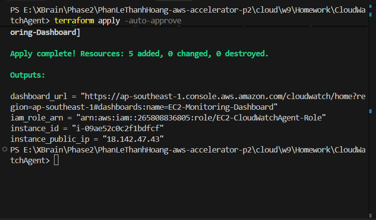
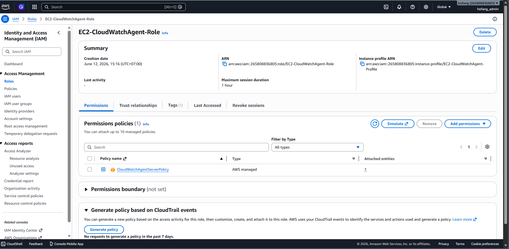
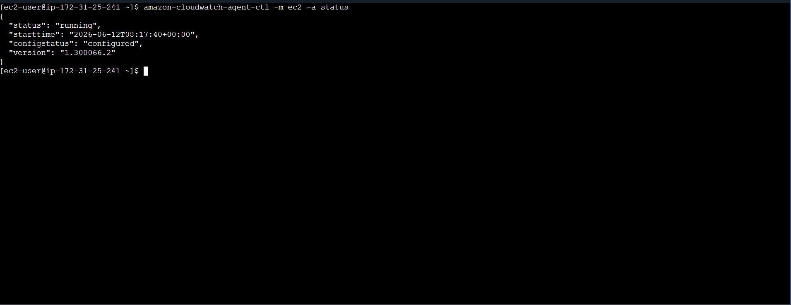
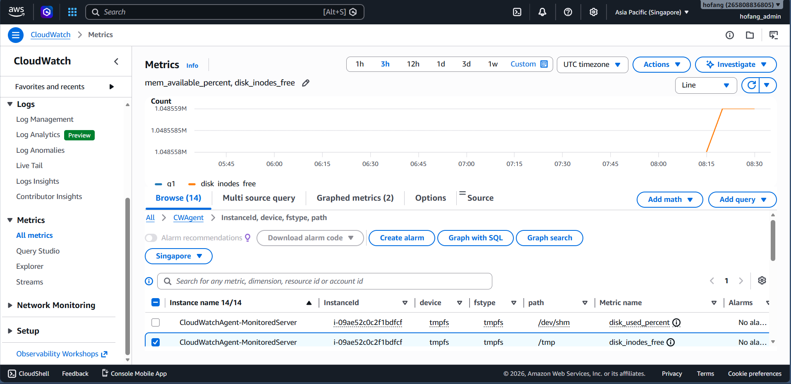
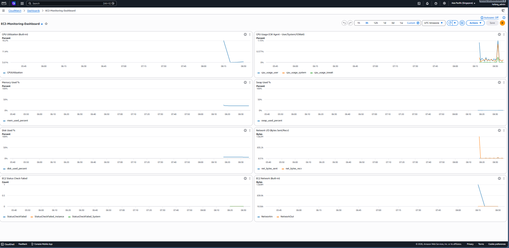

# Evidence Pack: Installing CloudWatch Agent on EC2 & Building a Monitoring Dashboard

## 🎯 Objective
Install and configure the **Amazon CloudWatch Agent** on an EC2 instance to collect **system-level metrics** (Memory, Disk, CPU detailed, Network) that are NOT available by default in CloudWatch. Then build a **CloudWatch Dashboard** to visualize all EC2 monitoring data in one place.

## 🏗️ Architecture & Services Used
- **Amazon EC2**: The compute instance being monitored.
- **IAM Role**: `CloudWatchAgentServerPolicy` attached to the EC2 instance — required for the agent to push metrics.
- **CloudWatch Agent**: Collects OS-level metrics (mem, disk, swap, net) and sends them to CloudWatch.
- **CloudWatch Dashboard**: Visualizes both built-in and custom agent metrics.
- **Terraform**: Infrastructure as Code tool used to automate the entire deployment.

## 💻 Implementation Details

- **`main.tf`**: Contains:
  - IAM Role + Instance Profile with `CloudWatchAgentServerPolicy`
  - EC2 Instance with `user_data` that automates all 4 steps (Install → Configure → Start → Verify)
  - CloudWatch Dashboard with 8 widgets (CPU, Memory, Disk, Network, Status Checks)
- **`variables.tf`**: Parameterizes region, instance type, dashboard name, CW agent namespace.
- **`terraform.tfvars`**: Stores the actual variable values for the deployment.

### Key Terraform Resources Deployed:
1. `aws_iam_role` + `aws_iam_role_policy_attachment`: IAM Role with `CloudWatchAgentServerPolicy`.
2. `aws_iam_instance_profile`: Attaches the role to the EC2 instance.
3. `aws_instance`: EC2 instance with `user_data` script that installs & configures the CloudWatch Agent.
4. `aws_cloudwatch_dashboard`: Dashboard with 8 monitoring widgets.

---

## 📋 Step-by-Step Guide to Collect Evidence

### Step 1: Deploy Infrastructure with Terraform

```bash
cd cloud/w9/Homework/CloudWatchAgent
terraform init
terraform apply -auto-approve
```

📸 **Screenshot cần chụp:**
- Terminal hiển thị `terraform apply` thành công (Apply complete! Resources: X added)

---

### Step 2: Verify IAM Role (Prerequisite)
1. Vào **AWS Console → IAM → Roles**
2. Tìm role `EC2-CloudWatchAgent-Role`
3. Kiểm tra đã attach policy `CloudWatchAgentServerPolicy`

📸 **Screenshot cần chụp:**
- IAM Role detail page hiển thị **CloudWatchAgentServerPolicy** đã attached

---

### Step 3: SSH vào EC2 & Verify Agent Status
Chờ khoảng **2-3 phút** sau khi EC2 khởi động (để user_data chạy xong), rồi SSH vào:

```bash
# Lấy Public IP từ terraform output
terraform output instance_public_ip

# SSH vào EC2 (nếu có key pair)
ssh -i <your-key.pem> ec2-user@<PUBLIC_IP>

# Hoặc dùng EC2 Instance Connect từ AWS Console
```

Sau khi SSH vào, chạy các lệnh kiểm tra:

```bash
# Kiểm tra agent status
sudo /opt/aws/amazon-cloudwatch-agent/bin/amazon-cloudwatch-agent-ctl -m ec2 -a status

# Kiểm tra agent đang chạy
sudo systemctl status amazon-cloudwatch-agent

# Xem config đã apply
cat /opt/aws/amazon-cloudwatch-agent/etc/amazon-cloudwatch-agent.json
```

📸 **Screenshot cần chụp:**
- Output của lệnh `amazon-cloudwatch-agent-ctl -m ec2 -a status` → hiển thị **"status": "running"**
- Output của `systemctl status` → hiển thị **active (running)**

---

### Step 4: Verify Custom Metrics in CloudWatch Console
Chờ khoảng **5-10 phút** để agent gửi metrics lên CloudWatch, rồi:

1. Vào **AWS Console → CloudWatch → Metrics → All metrics**
2. Tìm namespace **CWAgent**
3. Drill down vào **InstanceId** → sẽ thấy các metrics:
   - `mem_used_percent`
   - `disk_used_percent`
   - `cpu_usage_user`, `cpu_usage_system`, `cpu_usage_iowait`
   - `swap_used_percent`
   - `net_bytes_sent`, `net_bytes_recv`

📸 **Screenshot cần chụp:**
- CloudWatch Metrics → CWAgent namespace hiển thị danh sách metrics
- Chọn 1 metric (ví dụ `mem_used_percent`) → graph hiển thị data

---

### Step 5: View CloudWatch Dashboard
1. Vào **AWS Console → CloudWatch → Dashboards**
2. Click vào dashboard **EC2-Monitoring-Dashboard**
3. Sẽ thấy 8 widgets hiển thị metrics

📸 **Screenshot cần chụp:**
- Dashboard overview hiển thị tất cả 8 widgets
- Close-up của widget **Memory Used %** (metric từ CW Agent, không có sẵn trên AWS)
- Close-up của widget **CPU Utilization** (built-in metric)

---

### Step 6: Clean Up (After collecting evidence)

```bash
terraform destroy -auto-approve
```

---

## 📸 Evidence Checklist & Screenshots

Below is the required evidence demonstrating the successful completion and validation of this lab.

### 1. Infrastructure Provisioning (Terraform)
- **Action**: Run `terraform init` and `terraform apply` to provision all resources (IAM Role, EC2 Instance, CloudWatch Dashboard).
- **Evidence**:
  

### 2. IAM Role with CloudWatchAgentServerPolicy (Prerequisite)
- **Action**: Verify the EC2 instance has the IAM Role with `CloudWatchAgentServerPolicy` attached.
- **Evidence**:
  

### 3. CloudWatch Agent Running on EC2
- **Action**: SSH into the EC2 instance and verify the CloudWatch Agent is installed and running.
- **Evidence**:
  

### 4. Custom Metrics in CloudWatch (CWAgent Namespace)
- **Action**: Verify custom system-level metrics (Memory, Disk, Swap, Network) are being collected under the `CWAgent` namespace — metrics that are NOT available by default.
- **Evidence**:
  

### 5. CloudWatch Dashboard — EC2 Monitoring
- **Action**: View the pre-configured CloudWatch Dashboard showing all 8 monitoring widgets.
- **Evidence**:
  

---
**Completed by**: Phan Le Thanh Hoang
