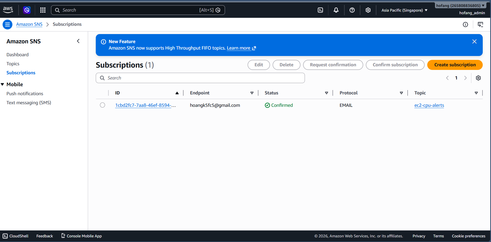
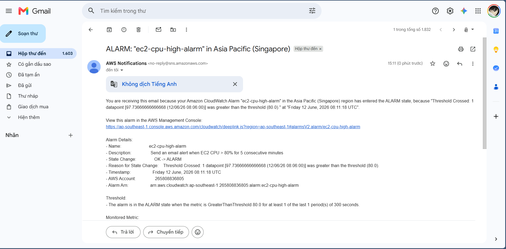
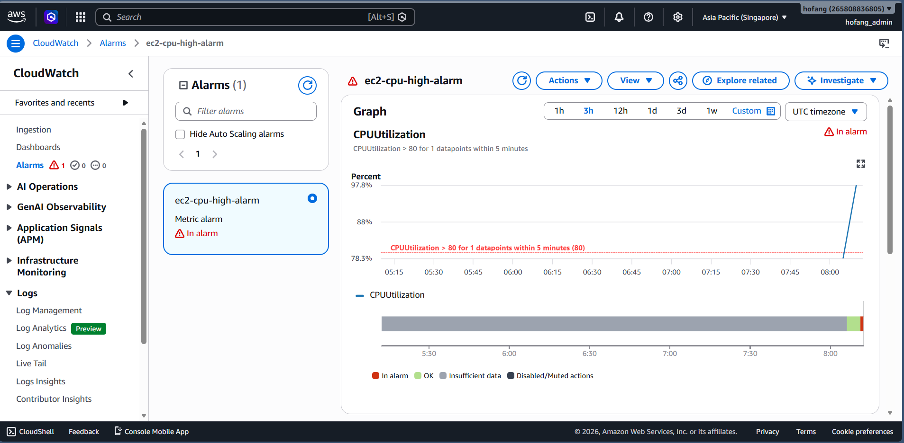
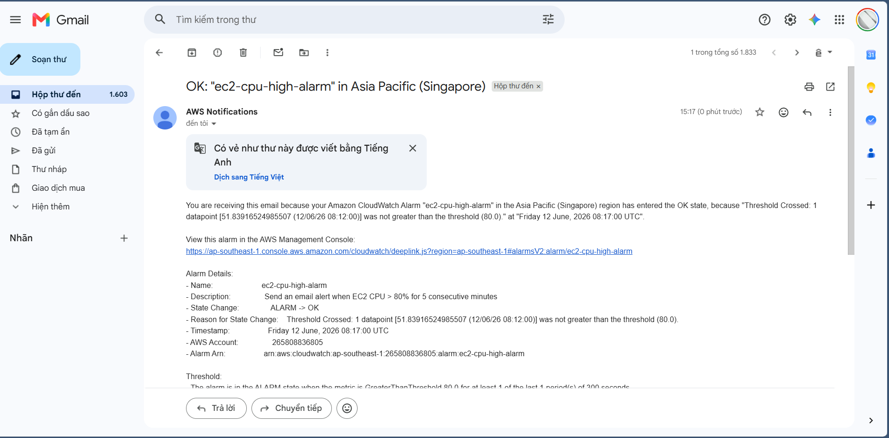

# Evidence Pack: EC2 CPU Alarm via SNS

## 🎯 Objective
Configure an AWS CloudWatch Alarm to monitor an EC2 instance's CPU utilization and trigger an email notification via Amazon SNS when the CPU usage exceeds 80% for 5 consecutive minutes.

## 🏗️ Architecture & Services Used
- **Amazon EC2**: The compute instance being monitored.
- **Amazon CloudWatch**: Monitors the `CPUUtilization` metric.
- **Amazon SNS**: Handles the notification delivery via Email.
- **Terraform**: Infrastructure as Code tool used to automate the deployment.

## 💻 Implementation Details
We used Terraform to automate the provisioning of the required infrastructure to ensure repeatability and accuracy.

- **`main.tf`**: Contains the logic for creating the EC2 instance, SNS Topic, Email Subscription, and CloudWatch Metric Alarm. We also injected a `user_data` script to automatically stress-test the CPU upon launch.
- **`variables.tf`**: Parameterizes the configuration (e.g., `alarm_threshold`, `alarm_period`, `alert_email`) following best practices.
- **`terraform.tfvars`**: Stores the actual variable values for the deployment.

### Key Terraform Resources Deployed:
1. `aws_sns_topic`: Creates the SNS Topic (`ec2-cpu-alerts`).
2. `aws_sns_topic_subscription`: Subscribes the user's email to the SNS Topic.
3. `aws_cloudwatch_metric_alarm`: Creates the alarm based on the EC2 `CPUUtilization` metric (`GreaterThanThreshold`, `80%`, `300s`).
4. `aws_instance`: An EC2 instance deployed with `user_data` to automatically run `stress --cpu 4 --timeout 600s` for validation.

---

## 📸 Evidence Checklist & Screenshots

Below is the required evidence demonstrating the successful completion and validation of this lab.

### 1. Infrastructure Provisioning (Terraform)
- **Action**: Run `terraform init` and `terraform apply` to provision all required resources.

### 2. SNS Topic & Subscription Confirmation
- **Action**: Verify the SNS Topic is created in AWS and the email subscription is successfully confirmed by the user.
- **Evidence**:
  

### 3. CloudWatch Alarm Configuration
- **Action**: Verify the CloudWatch Alarm is created with the correct conditions (CPU > 80% for 1 datapoint of 5 minutes).
- **Evidence**:
  

### 4. Alarm Triggered (ALARM State)
- **Action**: The EC2 instance's `user_data` script runs `stress` to push CPU usage to 100%. After 5 minutes, the alarm correctly identifies the breach and enters the `ALARM` state, triggering an SNS notification.
- **Evidence**:
  

### 5. Alarm Recovery (OK State)
- **Action**: After 10 minutes, the stress test automatically finishes. CPU usage drops back to normal, and the alarm enters the `OK` state, triggering a recovery email.
- **Evidence**:
  

---
**Completed by**: Phan Le Thanh Hoang
