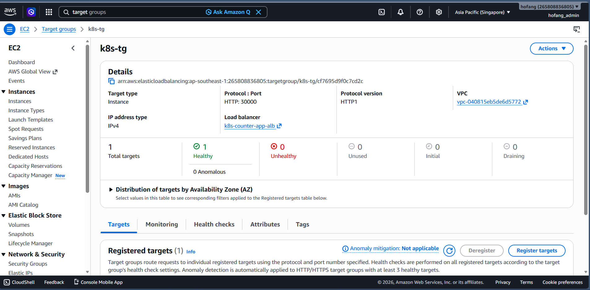
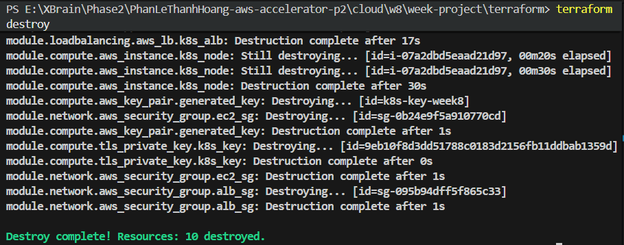

# Evidence - K8s on AWS Terraform 1-Click

## Nộp Gì

Deliverables:
- Repo Terraform đầy đủ trong folder `week-project`.
- `README.md` đầy đủ hướng dẫn.
- Bằng chứng app chạy qua ALB (ảnh/clip).
- Bằng chứng destroy sạch.

## Lệnh Chạy

Chạy từ folder `terraform`:

```bash
terraform init
terraform apply -auto-approve
```

Lấy URL ALB:

```bash
terraform output alb_dns_name
```

Destroy:

```bash
terraform destroy -auto-approve
```

## Bằng Chứng Cần Chụp

### 1. Terraform Apply Thành Công

Chụp terminal có output `Apply complete` và các outputs.

Ảnh/clip:


### 2. URL ALB Mở Được App

URL: `http://k8s-counter-app-alb-1518439158.ap-southeast-1.elb.amazonaws.com`

Bằng chứng browser:

### 3. App Thực Sự Chạy Trong Kubernetes

SSH vào EC2 để kiểm tra:

```bash
ssh -i k8s-key.pem ubuntu@47.129.242.88
```

Kiểm tra cluster:

```bash
sudo -u ubuntu kubectl get nodes
sudo -u ubuntu kubectl get pods
sudo -u ubuntu kubectl get svc
sudo -u ubuntu kubectl get deploy
```

Bằng chứng (Chụp output các lệnh trên trong EC2):

### 4. ALB Forward Vào NodePort

Port matching:
```text
ALB :80 -> EC2 :30000 -> socat port forward -> Minikube IP :30000 -> Service NodePort :30000 -> Pod :80
```

Các nơi dùng chung biến `app_port = 30000`:
- ALB Target Group port.
- EC2 Security Group ingress.
- `socat` listen và forward port.
- Kubernetes Service `nodePort`.

Bằng chứng (Output AWS CLI báo Target Group Healthy):
```json
{
    "TargetHealthDescriptions": [
        {
            "Target": {
                "Id": "i-07a2dbd5eaad21d97",
                "Port": 30000
            },
            "HealthCheckPort": "30000",
            "TargetHealth": {
                "State": "healthy"
            }
        }
    ]
}
```

### 5. Destroy Sạch

Chạy:

```bash
terraform destroy -auto-approve
```

Bằng chứng terminal báo `Destroy complete!`:


### 6. ArgoCD Đã Cài Và Quản Lý App (GitOps)

Sau khi EC2 khởi động, `init.sh` tự động cài ArgoCD và tạo Application CRD. Kiểm tra:

```bash
# SSH vào EC2
ssh -i k8s-key.pem ubuntu@<EC2_IP>

# Kiểm tra ArgoCD pods đang chạy
kubectl -n argocd get pods
```

Output kỳ vọng:
```text
NAME                                                READY   STATUS    RESTARTS   AGE
argocd-application-controller-0                     1/1     Running   0          10m
argocd-applicationset-controller-5f7b9d6b8-xxxxx    1/1     Running   0          10m
argocd-dex-server-6dcf645d6-xxxxx                   1/1     Running   0          10m
argocd-notifications-controller-7f8d9db8b-xxxxx     1/1     Running   0          10m
argocd-redis-69f8795ddb-xxxxx                       1/1     Running   0          10m
argocd-repo-server-7b5c9cc89-xxxxx                  1/1     Running   0          10m
argocd-server-6b8d5f4bc7-xxxxx                      1/1     Running   0          10m
```

Kiểm tra Application đã Synced:
```bash
kubectl -n argocd get applications
```

Output kỳ vọng:
```text
NAME                 SYNC STATUS   HEALTH STATUS
counter-app-gitops   Synced        Healthy
```

**Giải thích:** ArgoCD Application trỏ tới repo Git path `cloud/w9/sample_app/Counter-App/kubernetes`, tự động sync manifest vào cluster. Trạng thái `Synced` = cụm khớp Git, `Healthy` = pods đang chạy tốt.

### 7. Lab 3 — Self-heal: ArgoCD Tự Sửa Khi Bị Thay Đổi Tay

**Mục tiêu:** Chứng minh khi ai đó `kubectl scale` tay (vi phạm Git), ArgoCD sẽ tự động kéo cụm về đúng trạng thái trong Git (nguyên tắc Reconciled).

**Bước 1 — Xác nhận trạng thái ban đầu (Git nói `replicas: 2`):**
```bash
kubectl get deploy counter-app-deploy
```
```text
NAME                 READY   UP-TO-DATE   AVAILABLE   AGE
counter-app-deploy   2/2     2            2           15m
```

**Bước 2 — Scale tay lên 5 (vi phạm Git):**
```bash
kubectl scale deploy/counter-app-deploy --replicas=5
kubectl get deploy counter-app-deploy
```
```text
NAME                 READY   UP-TO-DATE   AVAILABLE   AGE
counter-app-deploy   5/5     5            5           16m
```
→ Tạm thời có 5 pods. Nhưng Git vẫn nói `replicas: 2`.

**Bước 3 — Đợi ArgoCD self-heal (vài giây ~ 3 phút):**
```bash
# Theo dõi real-time
kubectl get deploy counter-app-deploy -w
```
```text
NAME                 READY   UP-TO-DATE   AVAILABLE   AGE
counter-app-deploy   5/5     5            5           16m
counter-app-deploy   2/2     2            2           17m    # ← ArgoCD kéo về 2
```

**Kết quả:** ArgoCD phát hiện cụm (5 pods) lệch Git (2 pods) → tự động apply lại `replicas: 2` → cụm trở về đúng trạng thái Git. **Self-heal hoạt động.**

**Nguyên lý:** Đây là nguyên tắc thứ 4 của OpenGitOps — **Reconciled**. ArgoCD liên tục so sánh desired state (Git) vs actual state (cluster). Bất kỳ drift nào (do `kubectl` tay, do bug, do ai đó can thiệp) đều bị sửa tự động nhờ `selfHeal: true` trong Application spec.

### 8. Lab 4 — Rollback: Dùng `git revert` Thay Vì `kubectl rollout undo`

**Mục tiêu:** Chứng minh trong GitOps, rollback đúng cách là sửa Git (dùng `git revert`), không phải sửa cụm (`kubectl rollout undo`).

#### Tại sao `kubectl rollout undo` thất bại trong GitOps?

```bash
# Giả sử Git đang có image: hofang42/counter-app:v2
# Developer muốn rollback về v1:
kubectl rollout undo deploy/counter-app-deploy
```

Tạm thời cụm về v1. Nhưng vài phút sau:
```text
ArgoCD check: Git nói v2, cụm đang v1 → OutOfSync
Self-heal kick in: Apply lại v2
→ Cụm lại chạy v2 → Rollback THẤT BẠI ❌
```

**Nguyên nhân:** `kubectl rollout undo` chỉ sửa cụm, không sửa Git (source of truth). ArgoCD tuân thủ Git → ghi đè lại.

#### Cách đúng: `git revert`

**Bước 1 — Commit thay đổi (ví dụ đổi image v1 → v2):**
```bash
# Trên máy local, sửa counter-app.yaml: image v1 -> v2
git commit -am "upgrade to v2"
git push
# ArgoCD sync → cụm chạy v2
```

**Bước 2 — Phát hiện v2 lỗi, rollback:**
```bash
git revert HEAD --no-edit
git push
```

**Bước 3 — ArgoCD tự sync cụm về v1:**
```bash
# Trên EC2, theo dõi:
kubectl get deploy counter-app-deploy -w
```
```text
NAME                 READY   UP-TO-DATE   AVAILABLE   AGE
counter-app-deploy   2/2     2            2           20m    # đang chạy v2
counter-app-deploy   2/2     0            2           23m    # ArgoCD bắt đầu rollback
counter-app-deploy   2/2     2            2           24m    # đã về v1
```

Kiểm tra image đã về v1:
```bash
kubectl get deploy counter-app-deploy -o jsonpath='{.spec.template.spec.containers[0].image}'
```
```text
hofang42/counter-app:v1
```

**Kết quả:** `git revert` tạo commit mới đảo ngược thay đổi → Git trở về v1 → ArgoCD sync cụm về v1. **Rollback thành công, có lịch sử đầy đủ trong Git.**

#### So sánh hai cách rollback:

| Tiêu chí | `kubectl rollout undo` | `git revert` |
|----------|:----------------------:|:------------:|
| **Tác động** | Chỉ cụm | Git + Cụm |
| **Lịch sử** | Mất sau 10 revisions | Git history vĩnh viễn |
| **Bị self-heal ghi đè** | ✅ Có | ❌ Không |
| **Audit trail** | Không biết ai rollback | Commit author + message |
| **Thời gian** | Ngay lập tức | 1-3 phút (ArgoCD poll) |

**Trade-off:** Chấp nhận vài phút latency để đổi lấy safety + traceability.

### 9. Lab 5 — App-of-apps: 1 Root Quản Nhiều App

**Mục tiêu:** Thay vì `kubectl apply` từng Application tay, tạo 1 Root Application trỏ tới thư mục `argocd/apps/`. Root tự tạo tất cả Application con.

**Cấu trúc thư mục:**
```text
sample_app/
  argocd/
    root.yaml              ← Root Application (apply 1 lần duy nhất)
    apps/
      counter-app.yaml     ← Application con (tự được root tạo)
```

**Kiểm tra Root đã quản lý app con:**
```bash
kubectl -n argocd get applications
```
```text
NAME                 SYNC STATUS   HEALTH STATUS
root                 Synced        Healthy
counter-app-gitops   Synced        Healthy
```

**Thêm app mới sau này:**
```bash
# Chỉ cần tạo file YAML trong argocd/apps/ rồi git push
# Root sẽ tự phát hiện và tạo Application mới
# KHÔNG cần kubectl apply nữa
```

**Kết quả:** `init.sh` chỉ apply `root.yaml` 1 lần duy nhất. Mọi app con đều được quản lý qua Git. **GitOps 100%.**

### 10. Lab 6 — Sync Waves: Ép Thứ Tự Apply

**Mục tiêu:** Dùng annotation `argocd.argoproj.io/sync-wave` để đảm bảo resources được apply đúng thứ tự.

**Thứ tự wave đã cấu hình:**
```text
Namespace (-1)  →  ConfigMap (0)  →  Deployment (1)  →  Service (2)
```

**Các file đã gắn sync-wave:**

| File | Resource | Wave | Lý do |
|------|----------|:----:|-------|
| `namespace.yaml` | Namespace `counter-app` | -1 | Tạo namespace trước mọi thứ |
| `counter-app.yaml` | ConfigMap `counter-app-config` | 0 | Config cần tồn tại trước Deployment |
| `counter-app.yaml` | Deployment `counter-app-deploy` | 1 | Pod cần ConfigMap đã sẵn sàng |
| `counter-app.yaml` | Service `counter-app-svc` | 2 | Service expose sau khi Deployment ready |

**Kiểm tra thứ tự trong ArgoCD UI:**
- Mở ArgoCD UI → chọn app `counter-app-gitops` → tab Sync → các wave apply đúng thứ tự
- Nếu thiếu wave: Deployment chạy trước ConfigMap → Pod lỗi `CreateContainerConfigError`

**Kết quả:** Resources được apply theo thứ tự wave nhỏ → lớn. ArgoCD đợi wave trước Healthy mới chạy wave sau.

### 11. Lab 7 — CI Validate (kubeconform) + Branch Protection

**Mục tiêu:** Tạo CI workflow validate K8s YAML trên PR. Kết hợp branch protection để chặn merge YAML lỗi.

**File `.github/workflows/validate.yml`:**
```yaml
name: validate
on:
  pull_request:
    paths:
      - 'cloud/w9/sample_app/Counter-App/kubernetes/**'
jobs:
  validate:
    runs-on: ubuntu-latest
    steps:
      - uses: actions/checkout@v4
      - run: |
          curl -sSLo kc.tgz https://github.com/yannh/kubeconform/...
          tar -xzf kc.tgz && sudo mv kubeconform /usr/local/bin/
      - run: kubeconform -strict -summary cloud/w9/sample_app/Counter-App/kubernetes/
```

**Branch Protection (GitHub UI):**
- Settings → Branches → Add rule cho `main`:
  - ✔ Require a pull request before merging
  - ✔ Require status checks to pass → chọn `validate`

**Test:** Tạo PR sửa manifest sai schema → job `validate` đỏ → nút Merge bị khóa.

## Provider Wire

Providers được dùng trong cùng cấu hình Terraform:
- `hashicorp/aws`
- `hashicorp/tls`
- `hashicorp/local`

Wire:
```text
tls_private_key.k8s_key
-> aws_key_pair.k8s_key_pair
-> aws_instance.k8s_node (key_name)
```
```text
tls_private_key.k8s_key
-> local_file.private_key
-> k8s-key.pem (lưu xuống máy tính để tiện việc SSH debug)
```
```text
templatefile("init.sh", {app_port = 30000})
-> aws_instance.k8s_node (user_data)
```

## Acceptance Checklist

### Hạ tầng (Terraform)
- [x] `1` lệnh từ repo sạch dựng được toàn bộ (`terraform apply -auto-approve`).
- [x] `terraform output alb_dns_name` trả về URL ALB.
- [x] Browser mở URL ALB thấy trang web app.
- [x] App chạy trong Kubernetes Pod (Minikube), không chạy trực tiếp trên EC2.
- [x] Service là `NodePort` và dùng port cố định `30000`.
- [x] ALB target group forward vào EC2 port `30000`.
- [x] Có ít nhất `2` providers được wire trong cùng cấu hình (`aws`, `tls`, `local`).
- [x] Giải thích được vì sao chọn `Minikube + socat + NodePort + ALB`.
- [x] `terraform destroy -auto-approve` dọn sạch sau khi test.
- [x] Có thể dựng lại từ đầu cho kết quả tương đương.

### GitOps (ArgoCD)
- [x] ArgoCD cài trong cụm và quản lý app qua Application CRD.
- [x] Self-heal hoạt động: `kubectl scale` tay → ArgoCD tự kéo về Git.
- [x] Rollback bằng `git revert` → ArgoCD sync cụm về version cũ.
- [x] App-of-apps: Root Application quản lý tất cả app con qua thư mục `argocd/apps/`.
- [x] Sync waves: Resources apply đúng thứ tự (Namespace → ConfigMap → Deployment → Service).
- [x] CI validate: `kubeconform` check K8s YAML trên mỗi PR.

## Vì Sao Thiết Kế Này Đạt

- **`Minikube`** chạy Kubernetes single-node trên EC2, đáp ứng đủ yêu cầu dùng Kubernetes trên 1 EC2.
- App được deploy tự động bởi **ArgoCD** thông qua GitOps pattern, không dùng `kubectl apply` tay — đảm bảo Git là single source of truth.
- **App-of-apps** pattern cho phép quản lý nhiều application qua 1 root, thêm app mới chỉ cần thả file YAML vào `argocd/apps/` + `git push`.
- **Sync waves** đảm bảo thứ tự deploy đúng (Namespace → Config → App → Service), tránh lỗi `CreateContainerConfigError`.
- **CI validate** (`kubeconform`) chặn YAML lỗi trước khi merge vào main, kết hợp branch protection.
- Việc sử dụng public image trên Docker Hub giúp loại bỏ sự phức tạp của ECR trong bài lab, tập trung hoàn toàn vào GitOps.
- Do Minikube tạo một mạng ảo riêng bên trong EC2 (Docker driver), việc dùng lệnh **`socat`** để forward port giúp mở thông đường từ máy chủ vật lý EC2 vào mạng của Minikube một cách gọn gàng, hiệu quả.
- **ALB** public expose app ra Internet qua HTTP port `80`, đảm bảo kiến trúc mạng theo chuẩn (Load Balancer đứng trước che chở cho EC2).
- Các provider phụ trợ **`tls`**, **`local`** có vai trò thiết thực để sinh SSH Key tự động, giải quyết bài toán truy cập EC2 debug mà không cần tạo key thủ công trên Console.
- Thiết kế đơn giản, tập trung, destroy dọn sạch 100% resource.

